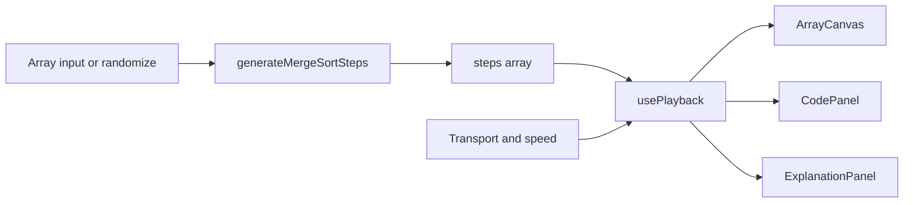

# AlgoViz — Interactive DSA Learning Platform (v1 Design)

**Date:** 2026-09-16  
**Status:** Approved for implementation planning (pending final user review of this doc)  
**POC algorithm:** Merge Sort  
**Product scope:** Platform shell + fully interactive Merge Sort tutorial

---

## 1. Goal

Build a modern, web-based educational platform that teaches data structures and algorithms through real-time visualization, step-synced code highlighting, and hands-on controls. v1 ships a reusable playback architecture and one complete module: **Merge Sort**.

### Success criteria

- Learner can play, pause, step forward/back, reset, change speed (0.5x–4x), randomize, and edit the input array.
- Array visualization, active code line, and explanation text stay in lockstep on every step.
- Complexity panel shows correct Big-O for Merge Sort (best / average / worst time + space).
- Catalog home lists algorithms; only Merge Sort is fully implemented; others show as placeholders.
- Works on desktop and mobile (split layout stacks on small screens).

---

## 2. Decisions locked

| Topic | Choice |
|--------|--------|
| Starter algorithm | Merge Sort |
| Product shape | Platform shell + Merge Sort module |
| Input | Randomize + editable comma-separated array |
| Animation architecture | Precomputed step timeline (immutable `steps[]`) |
| Tutorial layout | **B — Split studio** (viz+controls left; code/explain/complexity right) |
| Visual direction | **A — Sky lab** (slate ground, white panels, cyan brand; yellow=compare, green=done) |
| Animation library | Framer Motion on React bars (no Canvas/D3 in v1) |
| UI kit | Tailwind + Shadcn UI + Lucide |

---

## 3. Architecture

### 3.1 Principle

A pure **step generator** runs Merge Sort once for the current input and emits an ordered list of frames. The UI never re-executes the algorithm during playback; it only advances an index into `steps[]`. That single index drives the canvas, code highlight, and explanation.



### 3.2 Step frame schema

```ts
type HighlightKind = "comparing" | "writing" | "sorted" | "activeRange" | "copy";

type Step = {
  array: number[];
  highlights: { index: number; kind: HighlightKind }[];
  range?: { low: number; mid?: number; high: number }; // current subarray focus
  codeLineId: string; // stable id shared across Py / JS / C++
  explanation: string;
};
```

### 3.3 Playback controller (`usePlayback`)

State: `input`, `steps`, `index`, `playing`, `speed` (0.5 | 1 | 1.5 | 2 | 3 | 4).

Behavior:

- **Play / Pause** — interval or rAF tick; delay = `baseMs / speed`.
- **Step forward / back** — clamp index; pause if playing.
- **Reset** — index → 0; pause.
- **Randomize / valid edit** — regenerate `steps` from new input; index → 0; pause.
- **Invalid edit** — show inline validation; do not regenerate until valid.

### 3.4 Code sync

Each language listing is an array of `{ id, text }` lines. The same `codeLineId` values are used in all three languages so the highlight stays aligned when the learner toggles Python / JavaScript / C++.

---

## 4. UX & layout

### 4.1 Routes

- `/` — algorithm catalog (cards). Merge Sort links to the studio; others show “Coming soon”.
- `/algorithms/merge-sort` — Split studio tutorial page.

### 4.2 Split studio (desktop)

| Left (~58%) | Right (~42%) |
|-------------|--------------|
| Title + short intro | Code panel (language tabs) |
| Array canvas (bars) | Explanation callout |
| Control panel + speed slider | Complexity panel |
| Array input (edit + Randomize) | |

### 4.3 Mobile

Single column: canvas → controls → input → explanation → code → complexity.

### 4.4 Visual system (Sky lab)

- Background: cool slate (`slate-100` / `slate-200` wash).
- Surfaces: white panels, light slate borders, modest radius (not pill-heavy).
- Brand accent: cyan (`sky-600` / `sky-500`).
- Compare highlight: yellow / amber.
- Sorted / done: green.
- Typography: distinctive sans for UI (e.g. DM Sans or Source Sans); monospace for code. Avoid Inter/Roboto/Arial as the sole stack; avoid purple gradients and cream+terracotta tropes.
- Motion: bar height/color/layout transitions via Framer Motion; subtle control feedback — purposeful, not decorative noise.

### 4.5 Controls

Play, Pause, Step Forward, Step Backward, Reset, Randomize, Speed slider (0.5x–4x), editable array field.

Default array: 8–12 small integers (e.g. random 1–50). Max length capped (e.g. 16) so step counts stay teachable.

---

## 5. Merge Sort teaching content

### 5.1 Step coverage

Generator emits steps for:

1. Divide — enter left/right halves (`activeRange`).
2. Base case — single element / empty.
3. Merge compare — two candidates (`comparing`).
4. Write into temp / back into array (`writing` / `copy`).
5. Subarray completion (`sorted` within range).
6. Final fully sorted array.

Each step includes a short “what and why” explanation.

### 5.2 Complexity panel (Merge Sort)

| | Time | Space |
|--|------|-------|
| Best | O(n log n) | O(n) |
| Average | O(n log n) | O(n) |
| Worst | O(n log n) | O(n) |

Plus a one-line note: divide depth is log n; merge work per level is O(n); auxiliary array needed for merging.

---

## 6. File structure

```
app/
  layout.tsx
  page.tsx                          # catalog
  algorithms/merge-sort/page.tsx    # studio
  globals.css
components/
  layout/SiteHeader.tsx
  catalog/AlgorithmCard.tsx
  player/
    ArrayCanvas.tsx
    ControlPanel.tsx
    ArrayInput.tsx
    CodePanel.tsx
    ExplanationPanel.tsx
    ComplexityPanel.tsx
lib/
  algorithms/
    types.ts
    registry.ts                     # catalog metadata
    merge-sort/
      generateSteps.ts
      code.ts
      meta.ts
  playback/
    usePlayback.ts
components/ui/                      # Shadcn primitives
```

---

## 7. Error handling & edge cases

- Empty input, non-integers, or length > max → validation message; keep last good `steps`.
- Single-element and already-sorted arrays still produce a coherent short timeline.
- At last step, Play becomes no-op (or auto-pauses); Step Forward disabled.
- At index 0, Step Backward disabled.

---

## 8. Testing (v1)

- Unit tests for `generateMergeSortSteps`: known input → expected sorted final array; step count > 0; every `codeLineId` exists in all three code listings.
- Manual checklist: transport controls, speed change mid-play, language toggle preserves highlight meaning, mobile stack.

---

## 9. Out of scope (v1)

- Auth, accounts, progress persistence
- Quizzes / exercises beyond visualization
- Binary Search and other algorithms (catalog placeholders only)
- Canvas / D3 rendering
- Server-side execution of learner code

---

## 10. Implementation order (preview)

1. Scaffold Next.js + Tailwind + Shadcn + Framer Motion + Lucide.
2. Shared types + `usePlayback` + player chrome.
3. Merge Sort step generator + code listings + meta.
4. Wire Split studio page + Sky lab styling.
5. Catalog home + registry placeholders.
6. Tests + polish (validation, responsive, motion).

---

## 11. Open implementation details (non-blocking)

Resolved defaults if unspecified during build:

- Brand name in UI: **AlgoViz**
- Max array length: **16**
- Base step duration at 1x: **700ms**
- Default language tab: **Python**
