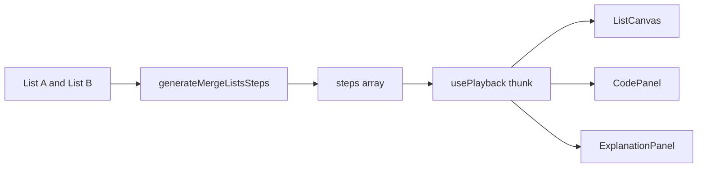

# Merge Two Sorted Lists — Design

**Date:** 2026-09-17  
**Status:** Approved in chat; this file is the locked spec  
**Prompt:** `docs/prompts/06-merge-lists.md`  
**Prerequisite:** Reverse List + Cycle Detection (`ListCanvas`, `ListFrame.head2`) already shipped

---

## 1. Goal

Add **one** algorithm: dummy-head merge of two sorted singly linked lists. Learners see list A, list B, and the growing merged result as three rows, with `p` / `q` / `tail` in lockstep with Python / JS / C++.

### Success criteria

- `/algorithms/merge-lists` plays a dummy-head merge; nodes leave the source row and appear on the merged row.
- Reverse List and Cycle Detection stay one-row and keep passing tests.
- Home **Linked Lists** section shows a third ready card.
- `npm test` passes.

---

## 2. Decisions locked

| Topic | Choice |
|--------|--------|
| Algorithm | Dummy-head iterative merge; stable (`p.val <= q.val` takes A) |
| Dummy node | **Not drawn.** `head` is `dummy.next`. Extra space is still O(1). |
| Frame heads | Keep existing `head` + `head2`. No `heads: { a, b, out }`. |
| `head` | Merged list start (`dummy.next`), or `null` |
| `head2` | Remaining B (`q`), or `null` |
| Pointers | `p`, `q`, `tail` (always present as keys in merge steps, values may be `null`) |
| Node ids | A: `0..n-1`. B: `100, 101, …` so ids never collide |
| Canvas | Three rows when merge pointers exist; one row otherwise |
| Unsorted input | **Sort on Apply** (same as Binary Search). Hint says so. |
| Length cap | Keep `MAX_LIST_LENGTH = 8`. Studio enforces `a.length + b.length <= 8`. |
| Empty lists | Allowed. Studio empty/whitespace → `[]` without changing `parseListInput` for reverse/cycle. |
| New canvas | No. Extend `ListCanvas` only. |

---

## 3. Architecture



Same playback model as Cycle Detection / LCS: studio holds `a` and `b` in React state; `usePlayback(() => generateMergeListsSteps(a, b), [0])` regenerates when the thunk identity changes.

The UI never re-runs the merge during play; it only advances `index`.

---

## 4. Step generator

**Signature:** `generateMergeListsSteps(a: number[], b: number[]): Step[]`

Does not mutate `a` or `b`. Does not sort — the studio sorts before calling.

### 4.1 Build nodes

- A nodes: `id = i`, `value = a[i]`, `next = i+1` or `null`.
- B nodes: `id = 100 + j`, `value = b[j]`, `next = 100+j+1` or `null`.
- Dummy is generator-local only (not in `nodes`). Canvas `tail` starts as `null`.

### 4.2 Algorithm (and when steps fire)

```
dummy = ListNode()       # not in nodes
tail = dummy             # pointers.tail = null
p = headA                # 0 or null
q = headB                # 100 or null
while p and q:
    compare              # p.val vs q.val
    attach smaller       # tail.next = chosen; advance that source; tail = chosen
tail.next = p or q       # append-rest
return dummy.next        # done
```

**Code line ids** (Python / JS / C++ share this set): `fn-def`, `dummy`, `loop`, `compare`, `attach`, `append-rest`, `done`.

Generated steps use: `fn-def`, `compare`, `attach`, `append-rest`, `done`. Listings may include `dummy` and `loop` for readability; steps need not land on them.

Equal values: attach from A (`<=`).

### 4.3 Display snapshot (hides the dangling source tail)

After `tail.next = p` (or `q`) the attached node still points at the rest of its source list until the next attach overwrites `next`. Walking `head` would then paint remaining A on the merged row.

For every frame **before** `append-rest`, clone nodes and if `tail` is a real node whose `next` is still `p` or `q`, set that clone’s `next` to `null`. After `append-rest`, leave `next` honest so the leftover chain is the merged suffix.

### 4.4 Frame per step

```
list.nodes        = snapshot (A nodes + B nodes only)
list.head         = dummy.next   # first attached id, else null
list.head2        = q
list.pointers     = { p, q, tail, head: dummy.next }
list.highlightIds = ids of p, q, tail that are non-null
step.array        = [...a, ...b]  # caption only; not the merge order
```

`pointers` always includes keys `p` and `q` so `ListCanvas` stays in merge layout through `done`.

### 4.5 Empty cases

- Both empty: `fn-def` → `append-rest` → `done`. `head` null, no nodes.
- One empty: `fn-def` → `append-rest` (whole non-empty list becomes merged) → `done`. No `compare`/`attach`.
- After `append-rest` / `done`: `p` and `q` pointers are `null` so source rows are empty; merged row is the full walk from `head`.

---

## 5. ListCanvas

### 5.1 Merge mode

`const merge = "p" in pointers && "q" in pointers;`

- **Merge:** three labeled rows — “List A” walk from `p`, “List B” walk from `q`, “Merged” walk from `head`. Layout each row in walk order (not id sort). Empty walk → that row shows a short empty placeholder, not a global “Empty list”.
- **Not merge:** today’s single row (id-sorted nodes, reverse/cycle arrows). No change to reverse or cycle.

Walk with existing `walkIds` from `lib/algorithms/reverse-list/listFrame.ts` (client-safe).

Cross-row `next` is not drawn. Each row only draws edges whose both ends sit on that row.

### 5.2 Pointers and color

Add `p`, `q`, `tail` to `POINTER_ORDER` and label colors:

- `p` — sky (like slow)
- `q` — amber (like curr/fast)
- `tail` — green (like next)

`nodeFill` treats `p` as sky, `q` as amber, `p`+`q` together as rose (rare), `tail` as green if not also `p`/`q`.

Merge legend: **p · q · tail · merged**. Reverse and cycle legends unchanged.

### 5.3 Tests (`__tests__/listCanvas.test.tsx`)

- Merge step with `p`/`q` shows texts “List A”, “List B”, “Merged”.
- Reverse and cycle cases still one chain (no those labels).
- Existing reverse/cycle tests still pass.

---

## 6. Studio and route

**Files:**

- Create `lib/algorithms/merge-lists/meta.ts` — slug `merge-lists`, title `Merge Two Sorted Lists`, family `linked-lists`, status `ready`. Complexity all O(n+m) time, O(1) extra. Note: dummy node, not a new array; contrast with allocating a result array.
- Create `lib/algorithms/merge-lists/code.ts` — three languages, same ids.
- Create `lib/algorithms/merge-lists/generateSteps.ts`
- Create `components/player/MergeListsStudio.tsx`
- Create `app/algorithms/merge-lists/page.tsx` — same shell as reverse/cycle.
- Modify `lib/algorithms/registry.ts` — import and append `mergeListsMeta`.
- Modify `components/player/index.ts` — export `MergeListsStudio`.
- Modify `lib/algorithms/parseInput.ts` — add `parseMergeListInput`.
- Modify `__tests__/parseInput.test.ts`, `__tests__/codeLineIds.test.ts`, `__tests__/listCanvas.test.tsx`.
- Create `__tests__/generateMergeListsSteps.test.ts`.

**Studio chrome:** clone Reverse List (split layout, `ListCanvas`, transport, code, explanation, complexity).

**Inputs:** two `ArrayInput`s, labels “List A” and “List B”. Defaults `[1, 3, 5]` and `[2, 4]`.

**`parseMergeListInput(raw)`:**

- Trim empty → `{ ok: true, values: [] }`.
- Else `parseListInput(raw)`.
- Combined cap is **not** inside this parser; studio checks `a.length + b.length <= MAX_LIST_LENGTH` on Apply and shows the error on the field just applied.

**Apply:** parse → sort copy ascending → store. Hint: “Each list is sorted on Apply. Combined length at most 8.”

**Randomize:** two short sorted arrays (length 2–4 each, sum ≤ 8), unique-enough values from the existing shuffle pool style.

**Empty Apply:** blank List A or List B is a valid empty list.

---

## 7. Tests for `generateMergeListsSteps`

- `[1,3,5]` + `[2,4]` final walk from `head` is `[1,2,3,4,5]`.
- One list empty → result is the other list’s values in order.
- Both empty → `head` null, no nodes, `done`.
- Duplicates: `[1,1]` + `[1,2]` → `[1,1,1,2]` (A wins ties).
- Does not mutate input arrays.
- Non-empty both-lists run contains `compare` and `attach`.
- Every step has `list`, non-empty explanation, `p` and `q` keys, and a `codeLineId` in the listings.
- Ids: A in `0..n-1`, B in `100…`.

Reverse-list and cycle-detection tests must still pass (no behavior change when merge pointers are absent).

---

## 8. Out of scope

- Other list algorithms (reverse/cycle already exist; no splice, no k-list merge).
- Drawing the dummy node.
- Raising `MAX_LIST_LENGTH` above 8.
- Rejecting unsorted input instead of sorting.
- New `heads: { a, b, out }` field.
- Recursion.

---

## 9. Done when

`npm test` passes; Linked Lists catalog card for Merge Two Sorted Lists; `/algorithms/merge-lists` shows two chains merging into a third row.
