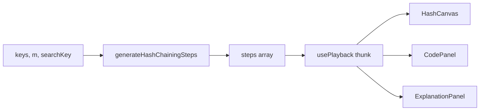

# Hash Table (Chaining) — Design

**Date:** 2026-09-18  
**Status:** Approved in chat; this file is the locked spec  
**Prompt:** `docs/prompts/07-hash-chaining.md`  
**Prerequisite:** none for hashing. This is the first hashing family member (`HashFrame`, `HashCanvas`). Linear probing is a later prompt.

---

## 1. Goal

Add **one** algorithm: hash table insert then search with **separate chaining**. Learners see buckets `0..m-1` and growing chains, in lockstep with Python / JS / C++.

### Success criteria

- `/algorithms/hash-chaining` inserts every key, then searches one key.
- Home **Hashing** section shows a ready card.
- Existing families and tests stay green.
- `npm test` passes.

---

## 2. Decisions locked

| Topic | Choice |
|--------|--------|
| Hash | `index = key % m`. Integer keys only. |
| Negatives | **Reject in parse.** No `((k % m) + m) % m`. |
| Duplicates | Walk until the match; emit `found`; **do not append**. |
| Insert then search | Insert all `keys` in order, then one `searchKey`. |
| Empty keys | Allowed. Search misses (no insert steps). |
| Empty chain | `hash` then `insert` or `miss` — no `walk`. |
| Canvas | New `HashCanvas`. Vertical buckets, chains to the right. |
| Probe mode | **Not in this pass.** No `slots`, no `layout: "probe"`. |
| Code listing | One compact listing. Ids unique. Insert and search share `hash` / `walk`. |

---

## 3. Architecture



Studio holds `keys`, `bucketCount`, and `searchKey` in React state. `usePlayback(() => generateHashChainingSteps(keys, bucketCount, searchKey), [0])` regenerates when the thunk identity changes (same pattern as Knapsack / merge-lists).

The UI never re-runs hashing during play; it only advances `index`.

---

## 4. Platform types

In `lib/algorithms/types.ts`:

```
AlgorithmFamily += "hashing"

MAX_HASH_KEYS = 10
MAX_HASH_BUCKETS = 8

HashFrame:
  bucketCount: number
  buckets: number[][]          # length m; each chain in insertion order
  op?: "insert" | "search"
  key?: number
  hashIndex?: number
  current?: { bucket: number; offset: number } | null
  found?: boolean
  status?: string

Step.hash?: HashFrame
```

`buckets` is required for chaining. Do not add `slots` or `layout` now.

`registry.ts`: import `hashChainingMeta`, append to `algorithms`. `FAMILY_ORDER` appends `"hashing"` after `"linked-lists"`. `FAMILY_TITLES.hashing = "Hashing"`.

---

## 5. Step generator

**Signature:** `generateHashChainingSteps(keys: number[], bucketCount: number, searchKey: number): Step[]`

Does not mutate `keys`. Assumes studio already validated: non-negative integers, `keys.length ≤ 10`, `bucketCount` in `3..8`.

`m = bucketCount`. Start with `m` empty chains. Clone `buckets` (new array per chain) on every emitted step. `step.array` is `[...keys]`. `step.highlights` is `[]`.

### 5.1 Sequence

```
emit fn-def                    # empty table, no key
for each key in keys:
    i = key % m
    emit hash                  # op=insert, current=null
    for offset, x in buckets[i]:
        emit walk              # current = { bucket: i, offset }
        if x == key:
            emit found         # skip append
            continue outer     # next key
    append key
    emit insert                # current = { bucket: i, offset: last }
i = searchKey % m
emit hash                      # op=search, current=null
for offset, x in buckets[i]:
    emit walk
    if x == searchKey:
        emit found
        emit done
        return
emit miss                      # current=null, found=false
emit done
```

Empty `keys`: skip the insert loop; search still runs.

### 5.2 Frame fields per step kind

| id | op | key | hashIndex | current | found | status |
|----|----|-----|-----------|---------|-------|--------|
| `fn-def` | omit | omit | omit | `null` | omit | omit |
| `hash` | insert or search | the key | `i` | `null` | omit | `hash(k) = k % m` |
| `walk` | same | the key | `i` | `{i, offset}` | omit | `scan chain` |
| `insert` | insert | the key | `i` | new tail | omit | `append` |
| `found` (dup insert) | insert | the key | `i` | matching node | `true` | `already present, skip` |
| `found` (search) | search | searchKey | `i` | matching node | `true` | `hit` |
| `miss` | search | searchKey | `i` | `null` | `false` | `not in chain` |
| `done` | last op or omit | last key or omit | last `i` or omit | last current or `null` | last found | omit |

`done` keeps the table as it stands after the search outcome so the canvas does not blank out.

### 5.3 Code listing

Ids, unique in each language: `fn-def`, `hash`, `walk`, `insert`, `found`, `miss`, `done`.

```
python:
  def chaining(table, key):           # fn-def
      i = key % len(table)            # hash
      for x in table[i]:              # walk
          if x == key: return True    # found
      table[i].append(key)            # insert
      return False                    # miss
  # done                              # done

javascript / cpp: same ids, idiomatic syntax.
```

Insert highlights `insert` instead of falling through to `miss`. Search highlights `found` or `miss` and never `insert`. Duplicate insert highlights `found`.

---

## 6. HashCanvas

**File:** `components/player/HashCanvas.tsx`. Export from `components/player/index.ts`.

Props: `{ step: Step | undefined }`. Reads `step.hash` only.

- Left column: bucket indices `0..m-1`.
- Right of each index: chain boxes in insertion order, arrows between nodes. Empty chain: short `∅` placeholder.
- Hashed row (`hashIndex`): sky. `current` node: amber. Found node (`found === true` and `current`): green.
- Caption (always): `hash(k) = k % m`. If `key` is set, also `k = {key} → bucket {hashIndex}`.
- Subtitle: `status` when present.
- Legend: **hash bucket · current · found**.
- Missing `hash` or `bucketCount === 0`: “No table to display”.

**Tests (`__tests__/hashCanvas.test.tsx`):**

- Caption includes `hash(k) = k % m`.
- After inserting `[10, 15, 20]` with m=5, bucket `0` and values `10`, `15`, `20` are visible.

---

## 7. Studio, parsers, and route

**Create:**

- `lib/algorithms/hash-chaining/meta.ts` — slug `hash-chaining`, title `Hash Table (Chaining)`, family `hashing`, status `ready`.
- `lib/algorithms/hash-chaining/code.ts`
- `lib/algorithms/hash-chaining/generateSteps.ts`
- `components/player/HashChainingStudio.tsx`
- `app/algorithms/hash-chaining/page.tsx` — same shell as merge-lists.

**Modify:** `types.ts`, `registry.ts`, `parseInput.ts`, `randomArray.ts`, `components/player/index.ts`, `__tests__/parseInput.test.ts`, `__tests__/codeLineIds.test.ts`.

**Complexity:** Best/Average `O(1)` time, `O(n)` space. Worst `O(n)` time, `O(n)` space. Note: load factor `n/m`; this viz does not resize; everything in one bucket is a linear scan.

**Studio chrome:** clone merge-lists (split layout, canvas, transport, code, explanation, complexity).

| Field | Default | Parser |
|--------|---------|--------|
| Keys | `[10, 15, 20, 7, 3]` | `parseHashKeysInput` |
| Buckets `m` | `5` | `parseBucketCount` |
| Search key | `15` | `parseHashKeyInput` |

Hint: “Non-negative integers. At most 10 keys. m is 3–8. Duplicate keys are not inserted.”

**Parsers** (in `parseInput.ts`):

- `parseHashKeysInput`: trim empty → `{ ok: true, values: [] }`. Else split like `parseArrayInput`, reject non-integers, reject any value `< 0`, cap length at `MAX_HASH_KEYS`.
- `parseBucketCount`: one integer, inclusive range `3..MAX_HASH_BUCKETS`.
- `parseHashKeyInput`: one non-negative integer (search). Empty is an error.

Do not change `parseArrayInput` or `parseTargetInput`.

**Randomize** (`randomHashChaining` in `randomArray.ts`): 6 distinct keys from the existing shuffle pool, `m = 5`. Search key is one of the six when `Math.random() < 0.5`; otherwise the smallest non-negative integer not in `keys` (miss).

**Apply:** parse → store. Do not sort keys (order is insertion order).

---

## 8. Generator tests

`__tests__/generateHashChainingSteps.test.ts`:

- `[10, 15, 20]`, m=5, any search: after the last insert (or at `done`), `buckets[0] === [10, 15, 20]`; other buckets `[]`.
- Same inserts, search `15` → some step `found` with `op === "search"`.
- Same inserts, search `1` → some step `miss`.
- `[]`, m=5, search `1` → `miss`; no `insert`.
- `[10, 10]`, m=5 → final bucket 0 is `[10]`; a `found` step with `op === "insert"`.
- Does not mutate the input array.
- Every step has `hash`, a non-empty `explanation`, and a `codeLineId` in the listings.

`codeLineIds.test.ts`: languages share the id set; generated steps use those ids (collision run, empty keys, duplicate, hit, miss).

`parseInput.test.ts`: empty keys ok; negatives rejected for keys and search; m `2` and `9` rejected; m `3` and `8` ok.

---

## 9. Out of scope

- Deletion, tombstones, resizing, load-factor rehash.
- Universal hashing, string keys.
- Open addressing / linear probing / `slots`.
- Accepting negative keys.

---

## 10. Done when

`npm test` passes; home **Hashing** catalog card; `/algorithms/hash-chaining` fills chains then searches.
