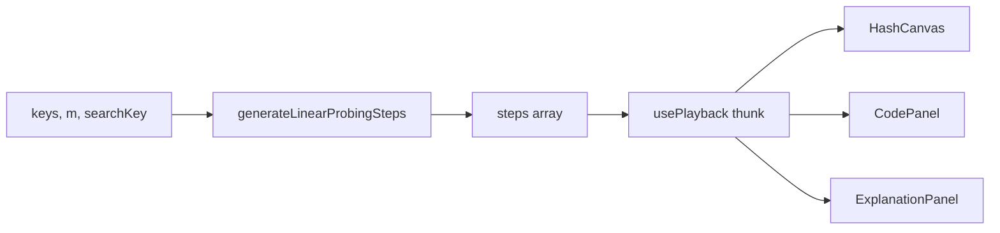

# Linear Probing — Design

**Date:** 2026-09-22  
**Status:** Approved in chat; this file is the locked spec  
**Prompt:** `docs/prompts/08-linear-probing.md`  
**Prerequisite:** Hash Table (Chaining) — `HashCanvas`, `HashFrame`, hashing family. Extend the canvas; do not rewrite chaining.

---

## 1. Goal

Add **one** algorithm: hash table insert then search with **open addressing / linear probing**. Learners see a single row of `m` slots, collisions walking to the next empty cell, in lockstep with Python / JS / C++.

### Success criteria

- `/algorithms/linear-probing` inserts every key (probing on collision), then searches one key.
- Home **Hashing** section shows a second ready card.
- Chaining layout, generators, and tests stay green.
- `npm test` passes.

---

## 2. Decisions locked

| Topic | Choice |
|--------|--------|
| Probe | `h(k, i) = (k % m + i) % m`. Integer keys only. |
| Negatives | **Reject in parse** (reuse chaining parsers). |
| Layout encoding | `HashFrame.layout?: "chain" \| "probe"`. Omit → `"chain"`. |
| Canvas | Same `HashCanvas`. Switch on `hash.layout ?? "chain"`. No `mode` prop. No second canvas. |
| Current probe | New `probeIndex?: number`. Do not reuse `{ bucket, offset }` for slots. |
| Home slot | Existing `hashIndex` = `k % m`. |
| Duplicates | Probe until the match; emit `found`; **do not overwrite**. |
| Insert then search | Insert all `keys` in order, then one `searchKey`. |
| Empty keys | Allowed. Search misses (no insert steps). |
| Full table | Emit `full`, skip remaining inserts, still run search. Probe loop capped at `m`. |
| Deletes | **None.** No tombstones. Search miss = empty slot or wrap with no match. |
| Studio load | Require `n < m`. Generator still accepts a full table for tests. |
| m range | Reuse `3..MAX_HASH_BUCKETS` (8). Default `7`. |
| Code listing | One compact listing. Ids unique. Insert and search share `hash` / `probe` / `found`. |

---

## 3. Architecture



Studio holds `keys`, `tableSize`, and `searchKey` in React state. `usePlayback(() => generateLinearProbingSteps(keys, tableSize, searchKey), [0])` regenerates when the thunk identity changes (same pattern as hash-chaining).

The UI never re-runs probing during play; it only advances `index`.

---

## 4. Platform types

In `lib/algorithms/types.ts`, `HashFrame` becomes:

```
HashFrame:
  bucketCount: number                 # m for both layouts
  buckets?: number[][]                # chaining; always set by chaining generator
  slots?: (number | null)[]           # probing; length m
  layout?: "chain" | "probe"          # omit → chain
  op?: "insert" | "search"
  key?: number
  hashIndex?: number                  # home slot k % m
  current?: { bucket: number; offset: number } | null   # chaining walk
  probeIndex?: number                 # current probe slot
  found?: boolean
  status?: string
```

Chaining generator stays unchanged: it still sets `buckets` and omits `layout` / `slots` / `probeIndex`.

`registry.ts`: import `linearProbingMeta`, append after `hashChainingMeta`. Family order and titles unchanged.

---

## 5. Step generator

**Signature:** `generateLinearProbingSteps(keys: number[], tableSize: number, searchKey: number): Step[]`

Does not mutate `keys`. Assumes studio already validated non-negative integers and `3 ≤ tableSize ≤ 8`. May be called with `keys.length >= tableSize` (tests).

`m = tableSize`. Start with `m` slots of `null`. Clone `slots` (`[...slots]`) on every emitted step. Every step has `layout: "probe"`, `bucketCount: m`, and `slots`. `step.array` is `[...keys]`. `step.highlights` is `[]`.

### 5.1 Sequence

```
emit fn-def                              # empty table, no key, no probeIndex
for each key in keys:
    home = key % m
    emit hash                            # op=insert, hashIndex=home, probeIndex omitted
    placed = false
    for i in 0 .. m-1:
        j = (home + i) % m
        emit probe                       # probeIndex=j
        if slots[j] === key:
            emit found                   # skip write
            placed = true
            break
        if slots[j] === null:
            slots[j] = key
            emit insert                  # probeIndex=j
            placed = true
            break
    if not placed:
        emit full                        # probeIndex = last j (home + m - 1) % m
        break                            # no more inserts
home = searchKey % m
emit hash                                # op=search, probeIndex omitted
for i in 0 .. m-1:
    j = (home + i) % m
    emit probe
    if slots[j] === searchKey:
        emit found
        emit done
        return
    if slots[j] === null:
        emit miss                        # empty slot
        emit done
        return
emit miss                                # wrapped; table had no hole
emit done
```

Empty `keys`: skip the insert loop; search still runs.

`done` keeps the table as it stands after the search outcome so the canvas does not blank out.

### 5.2 Frame fields per step kind

| id | op | key | hashIndex | probeIndex | found | status |
|----|----|-----|-----------|------------|-------|--------|
| `fn-def` | omit | omit | omit | omit | omit | omit |
| `hash` | insert or search | the key | `home` | omit | omit | `h(k, i) = (k % m + i) % m` |
| `probe` | same | the key | `home` | `j` | omit | `probe slot j` |
| `insert` | insert | the key | `home` | filled slot | omit | `place` |
| `found` (dup insert) | insert | the key | `home` | matching slot | `true` | `already present, skip` |
| `found` (search) | search | searchKey | `home` | matching slot | `true` | `hit` |
| `miss` (empty slot) | search | searchKey | `home` | empty slot | `false` | `empty slot` |
| `miss` (wrap) | search | searchKey | `home` | last probed | `false` | `not found (full scan)` |
| `full` | insert | the key | `home` | last probed | omit | `table full` |
| `done` | last op or omit | last key or omit | last home or omit | last probeIndex or omit | last found | omit |

### 5.3 Code listing

Ids, unique in each language: `fn-def`, `hash`, `probe`, `insert`, `found`, `miss`, `full`, `done`.

```
python:
  def probing(table, key):                 # fn-def
      home = key % len(table)              # hash
      for i in range(len(table)):
          j = (home + i) % len(table)      # probe
          if table[j] == key: return True  # found
          if table[j] is None:
              table[j] = key               # insert
              return False                 # miss
      return False                         # full
  # done                                   # done

javascript / cpp: same ids, idiomatic syntax.
```

Highlight mapping:

- Place a key → `insert`
- Duplicate insert → `found`
- Insert exhausted (no empty slot) → `full`
- Search hit → `found`
- Search empty slot → `miss`
- Search wrap (no empty slot) → `miss`

---

## 6. HashCanvas

**File:** `components/player/HashCanvas.tsx` (extend). Still exported from `components/player/index.ts`. Props unchanged: `{ step: Step | undefined }`.

Missing `hash` or `bucketCount === 0`: “No table to display”.

**Chain** (`layout` omitted or `"chain"`): existing vertical buckets. `buckets` missing → treat as empty chains (`[]`). Caption still `hash(k) = k % m`. No visual change.

**Probe** (`layout === "probe"`):

- One row of `m` cells, `aria-label="Hash table"`. Each cell `aria-label="slot {j}"`.
- Values from `hash.slots`; if `slots` is missing, treat every cell as `null`.
- Value or dashed `∅` when `null`.
- Home (`hashIndex === j`): sky background on the cell.
- Current probe (`probeIndex === j`): amber fill. If `found === true` as well: green. Probe highlight wins over home when they coincide.
- Caption (always): `h(k, i) = (k % m + i) % m`. If `key` is set and `hashIndex` is set, also `k = {key} → home {hashIndex}`.
- Subtitle: `status` when present.
- Legend: **home · probe · found**.

**Tests (`__tests__/hashCanvas.test.tsx`):** keep the three chaining cases. Add:

- A probe `fn-def` (or last step of `[5, 12]`, m=7) shows `h(k, i) = (k % m + i) % m` and `slot 5` / `slot 6` labels.
- Chaining last step still shows `bucket 0` (regression).

---

## 7. Studio, parsers, and route

**Create:**

- `lib/algorithms/linear-probing/meta.ts` — slug `linear-probing`, title `Linear Probing`, family `hashing`, status `ready`.
- `lib/algorithms/linear-probing/code.ts`
- `lib/algorithms/linear-probing/generateSteps.ts`
- `components/player/LinearProbingStudio.tsx`
- `app/algorithms/linear-probing/page.tsx` — same shell as hash-chaining.

**Modify:** `types.ts`, `registry.ts`, `randomArray.ts`, `components/player/index.ts`, `HashCanvas.tsx`, `__tests__/hashCanvas.test.tsx`, `__tests__/codeLineIds.test.ts`.

Do **not** change `parseHashKeysInput`, `parseBucketCount`, `parseHashKeyInput`, or chaining files except `HashCanvas` and types.

**Complexity:** Best/Average `O(1)` time, `O(m)` space. Worst `O(n)` time, `O(m)` space. Note: primary clustering; load factor `n/m`; this viz does not resize or delete.

**Studio chrome:** clone hash-chaining (split layout, canvas, transport, code, explanation, complexity).

| Field | Default | Parser |
|--------|---------|--------|
| Keys | `[5, 12]` | `parseHashKeysInput`, then `n < m` |
| Table size `m` | `7` | `parseBucketCount` (range 3–8) |
| Search key | `12` | `parseHashKeyInput` |

Hint: “Non-negative integers. Fewer keys than m (n < m). m is 3–8. Duplicate keys are not inserted.”

**Cross-field `n < m`:** after a successful parse, if `keys.length >= m`, set an error on the field the user just applied (`Need fewer keys than table size m (n < m).`) and do not update that field’s committed state. The other field stays as last accepted.

**Randomize** (`randomLinearProbing` in `randomArray.ts`): `m = 7`, `n = 3 + Math.floor(Math.random() * 3)` so `n` is 3–5 (`≤ m-2`). Distinct keys from the existing shuffle pool. Search key is one of the keys when `Math.random() < 0.5`; otherwise the smallest non-negative integer not in `keys`.

**Apply:** parse → store. Do not sort keys (order is insertion order).

---

## 8. Generator tests

`__tests__/generateLinearProbingSteps.test.ts`:

- `[5, 12]`, m=7, search `12`: after inserts (or at `done`), `slots[5] === 5`, `slots[6] === 12`; other slots `null`.
- Same inserts, search `12` → some step `found` with `op === "search"`.
- Same inserts, search `4` → some step `miss` (4 % 7 = 4, empty).
- `[0, 1, 2, 99]`, m=3, search `0` → some step `full`; generation finishes (no infinite loop); last step exists. Search still runs after `full`.
- `[5, 5]`, m=7 → `slots[5] === 5` only; a `found` step with `op === "insert"`.
- `[]`, m=7, search `1` → `miss`; no `insert`.
- Does not mutate the input array.
- Every step has `hash`, `hash.layout === "probe"`, `hash.slots` length `m`, a non-empty `explanation`, and a `codeLineId` in the listings.

`codeLineIds.test.ts`: languages share the id set; generated steps use those ids (collision run, empty keys, duplicate, hit, miss, full).

Chaining `generateHashChainingSteps` tests and chaining canvas tests still pass.

---

## 9. Out of scope

- Quadratic probing, double hashing.
- Deletion, tombstones, resizing, load-factor rehash.
- Universal hashing, string keys.
- Accepting negative keys.
- Rewriting the chaining generator or studio.

---

## 10. Done when

`npm test` passes; home **Hashing** catalog has Linear Probing; `/algorithms/linear-probing` shows 12 colliding into slot 5 and walking to slot 6.
